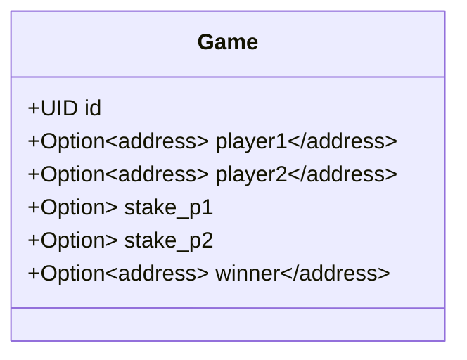
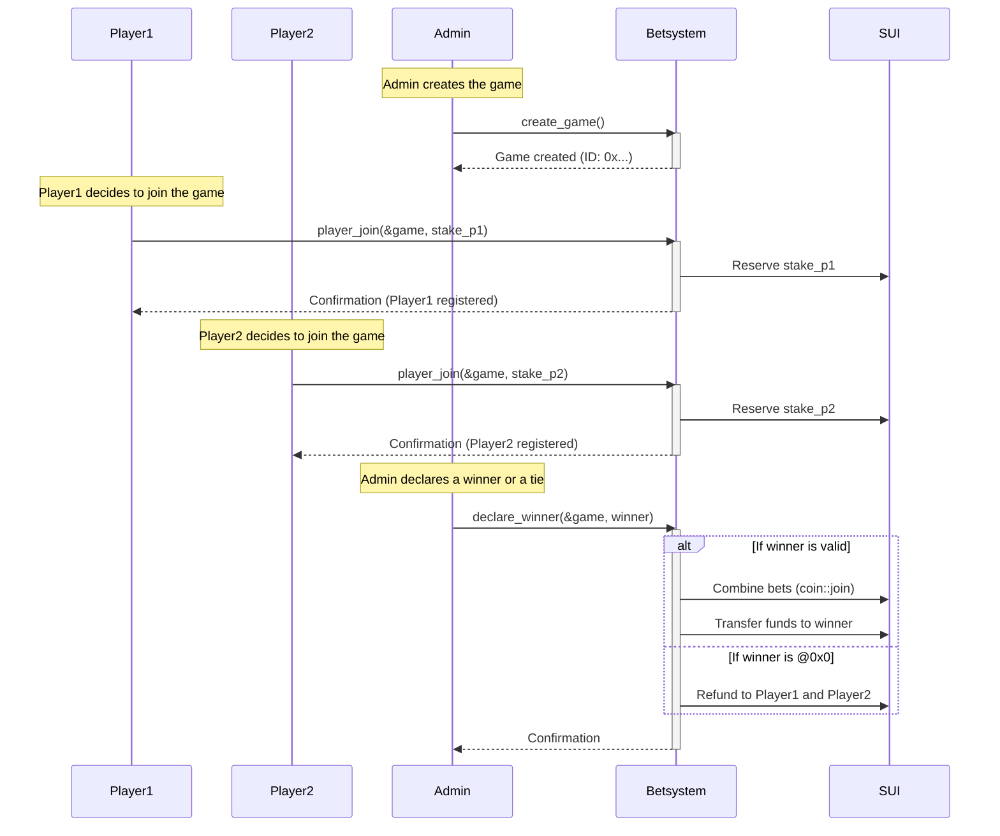
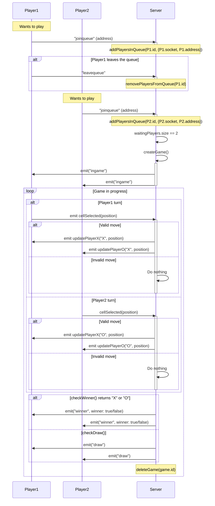

# About

I spent a good amount of time in the **crypto** and casino world (even though I’m not a fan of it, haha), which led me to the idea of building a smart contract on the Sui blockchain that stores players items and declares the winner of a game.

# Project Self-Critique
### Frontend
- The frontend is currently a mess. I’ve never worked with frontend development or React before, so the result is not that good

### Smart Contract Integration
- The smart contract is not yet integrated into the web frontend and backend

- The basic game flow I had in mind:

	- Player 1 joins the queue. The “admin” automatically creates the on-chain object. Player 1 is then locked into the game.
	- Player 2 joins the queue, and the game starts.

### Gas Fees (Admin Side)
One major issue not yet addressed is gas fee management on the admin side

- My idea to handle this is that both Player 1 and Player 2 would pay a small fee to the admin when a game is created

### Hibrid?
Another major issue is the power of the admin address, as it can create the game and declare a winner. Is this a problem? Not so much, because the assert functions prevent any "superpowers" from the admin. However, the essence of blockchain is decentralization, but what led me to treat this project as a hybrid is that I developed it with no prior knowledge of smart contracts, React, or ExpressJS

# Smart Contract
### Blockchain Game [Object](https://docs.sui.io/concepts/object-model)

### Players & Admin Flow with SUI Blockchain & Smart Contract

# Client - Server
### Player & Server Communication

