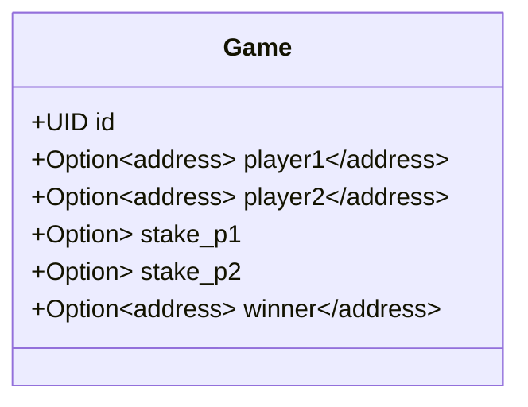
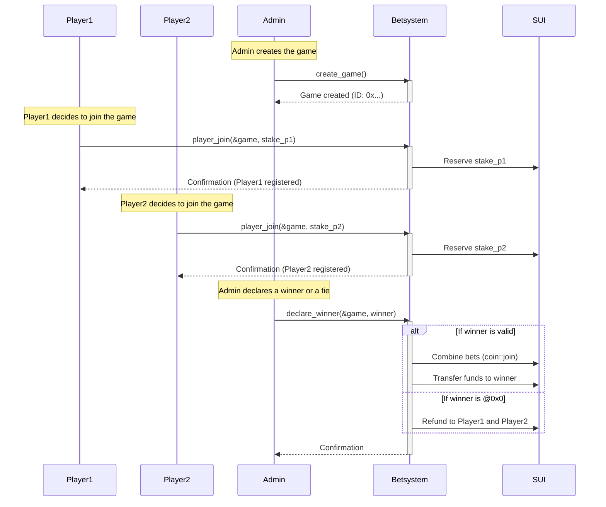
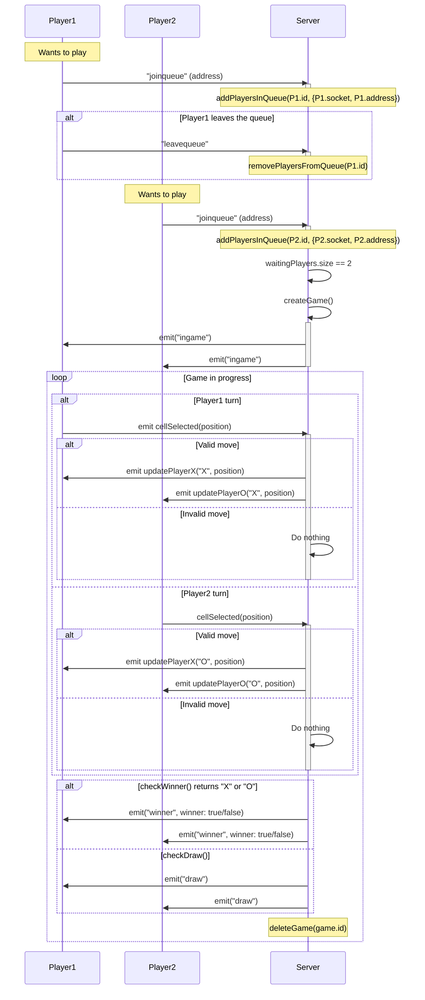

# Smart Contract
### Blockchain Game [Object](https://docs.sui.io/concepts/object-model)

### Players & Admin Flow with SUI Blockchain & Smart Contract

# Client - Server
### Player & Server Communication

