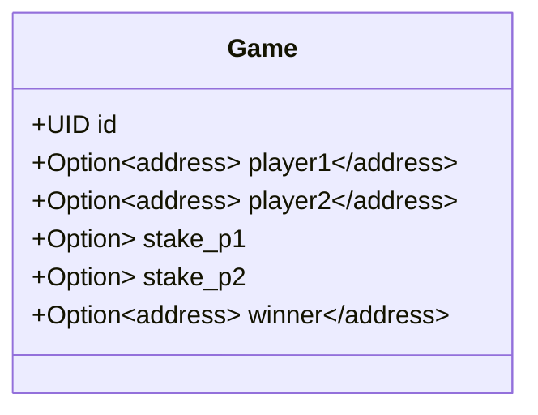
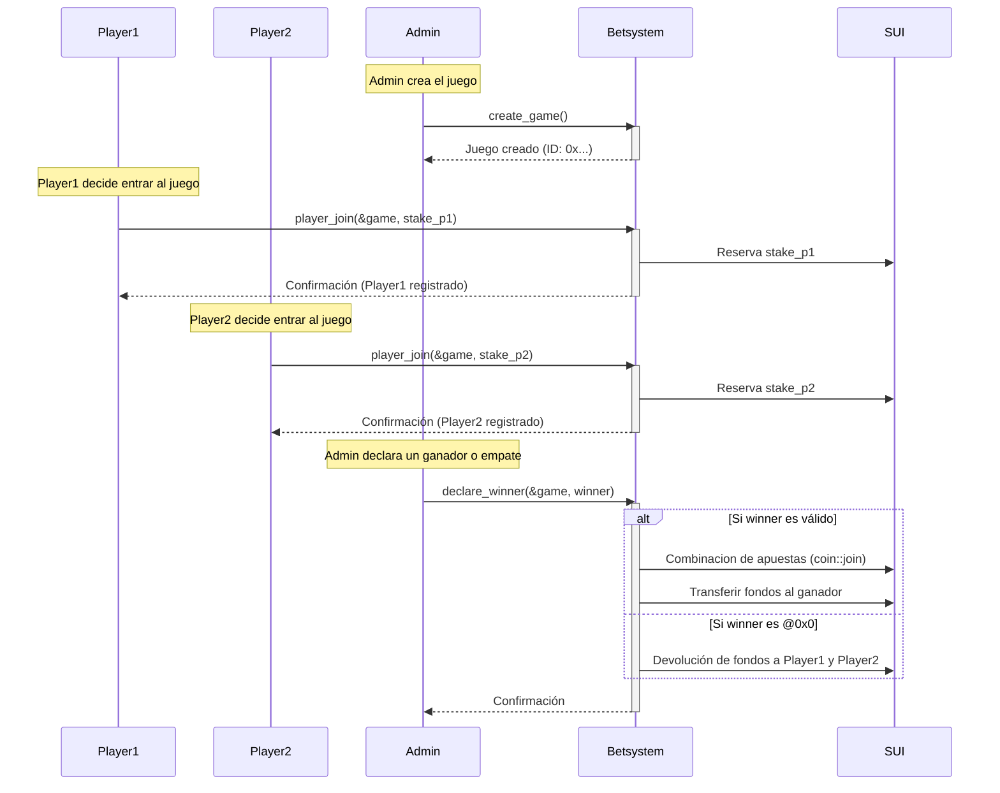
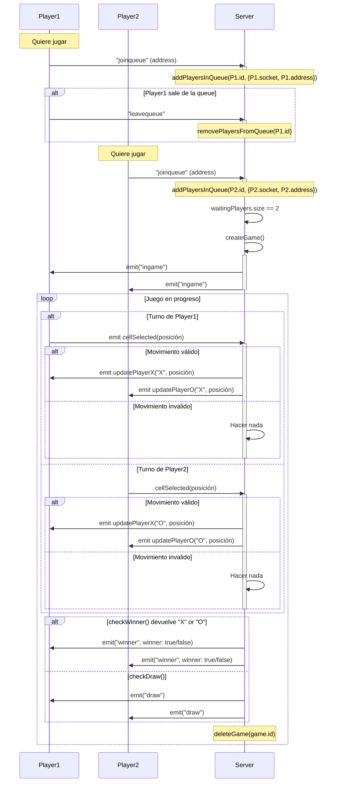

# Contrato inteligente (Smart Contract)
### Blockchain Game [Object](https://docs.sui.io/concepts/object-model)

### Flujo de jugadores y admin con la Blockchain y el Contrato Inteligente

# Client - Server
### Player & Server Communication

